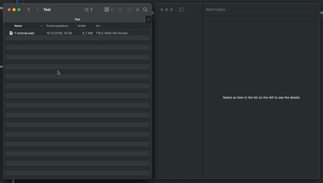
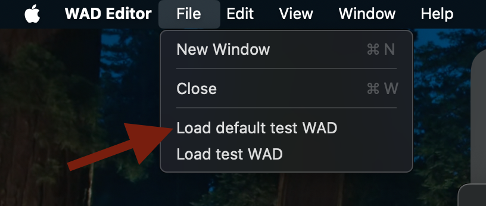
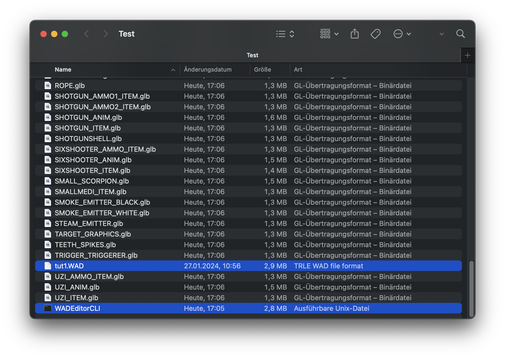

# TRTools
Tools for Tomb Raider Level Editor (TRLE and TRNG).


## Install
Download the source code:
```
git clone https://github.com/EvgenijLutz/TRTools.git
```
And you're good to go!


## WAD Editor
This is a tool with graphics user interface for macOS, iOS and iPadOS. You can open .wad files by dragging them into the window and export objects from the "Models" section (currently) to .glb by dragging them out of the object list.



The app also contains two test .wad bundles - first from original trle, and the second with custom animations made by the creator of this app. You can access them from the menu File > Load default test WAD and File > Load test WAD:
 



## WADEditorCLI
This is a command line tool for Windows and macOS to export all .wad objects from the "Models" section to .glb. Copy your .wad file to the same order as this tool and execute the following command in terminal on macOS:
```
./WADEditorCLI <your_wad_file>.wad
```

or in Windows (you can also drag your .wad file direct into the executable):
```
WADEditorCLI <your_wad_file>.wad
```


